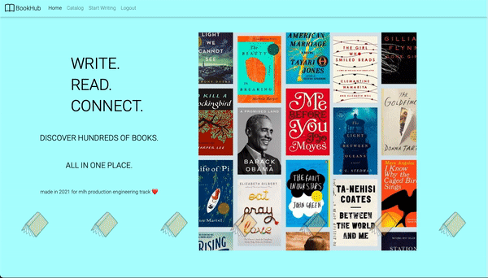

<br />

# Book Hub

A place where we can add and track our book notes for our reading journey.

## Inspiration

**Book Hub** aims to build a space where you can save your book reviews and track how many books you have been reading.

## What it does

- **Single Platform** for you to save your books and book notes
- Easy to track your reading journey (i.e how many books have you read?)
- Fully functional for you to make your Book Hub your own!
- Easy to filter books by tags!

## How to use Book Hub?

### Create an account or log in


### Browse existing entries

### Create new entries

Click on "start writing" on the top right corner to recommend a new book!


Enter your book details here...


Books are uploaded on a catalog


After you click "submit" this page will show up to confirm a successful upload


## How we built it

    
  

- **Frontend**: Flask, HTML, CSS, JS
- **Backend**: Python
- **Design**: Figma, Hand + Paper
- **Database**: SQLite3
- **Web Hosting**: AWS EC2
- **Container**: Docker
- **CI/CD Workflow**: Github Actions
- **Monitoring**: cAdvisor, Prometheus, Grafana
- **Version Control**: Git and GitHub

## Architecture

(diagram pictures)

## Challenges we ran into

## Accomplishments that we're proud of

## What we learned

## What's next for Book Hub

- [ ] Implement Update Book feature
- [ ] Increase test coverage of the whole project (current number: 37%)
- [ ] Improve filtering books by tags
- [ ] Add likes/comments for each book notes
- [ ] Improve authentication (i.e implement Forget Password)

### Contributing Guidelines

See [`CONTRIBUTING.md`](https://github.com/Taenerys/BookHub/blob/main/CONTRIBUTING.md).

### GitHub Repository Structure

| S.No. | Branch Name                                           | Purpose                                                       |
| ----- | ----------------------------------------------------- | ------------------------------------------------------------- |
| 1.    | [main](https://github.com/Taenerys/BookHub/tree/main) | contains the frontend, backend related code and documentation |

### Setup

- Fork and Clone the repo using

```
$ git clone https://github.com/Taenerys/BookHub.git
$ cd BookHub
```

- Make sure you have python3 and pip installed

Create and activate virtual environment using virtualenv

```bash
$ python -m venv python3-virtualenv
$ source python3-virtualenv/bin/activate
```

Use the package manager [pip](https://pip.pypa.io/en/stable/) to install all dependencies

```bash
pip install -r requirements.txt
```

- Run the Flask server using

```bash
$ export FLASK_ENV=development
$ flask run
```

## MLH Fellowship - Production Engineering Track ( Summer 2021)

> This is a final project made by MLH Production Engineering Fellows (Summer 2021) - Pod 3.3.3 Reliable Rhinos.


## Team:

> "It is the long history of humankind (and animal kind, too) that those who learned to collaborate and improvise most effectively have prevailed." _(Charles Darwin)_

| S.No. | Name                  | GitHub Username:octocat:                     |
| ----- | --------------------- | -------------------------------------------- |
| 1.    | Anh Pham              | [@Taenerys](https://github.com/PawanKolhe)   |
| 2.    | Emily Chen            | [@EmilyXinyi](https://github.com/EmilyXinyi) |
| 3.    | Dakshina Palasamudrum | [@dakshinabp](https://github.com/dakshinabp) |
| 4.    | Kweku Aboagye         | [@Kweku007](https://github.com/Kweku007)     |

<br>
<br>

## Contributors ✨

Thanks goes to these wonderful people ([emoji key](https://allcontributors.org/docs/en/emoji-key)):

This project follows the [all-contributors](https://github.com/all-contributors/all-contributors) specification. Contributions of any kind welcome!

[](https://github.com/Taenerys/BookHub)
[](https://github.com/Taenerys/BookHub)
[](https://github.com/Taenerys/BookHub)
[](https://github.com/Taenerys/BookHub)

[](https://github.com/Taenerys/BookHub)
[](https://github.com/Taenerys/BookHub)
[](https://github.com/Taenerys/BookHub)

---
